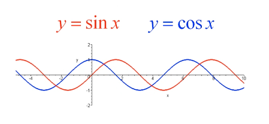
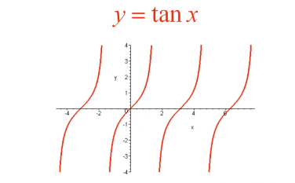
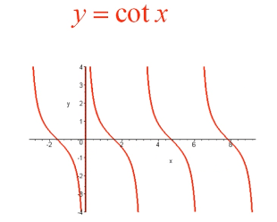

# 三角函数&反三角函数&双曲函数（Trigonometric function&Inverse trigonometric function&Hyperbolic function）

#### 1.定义

$y = \sin{x}$		$y=\cos{x}$

$\displaystyle y = \tan{x} = \frac{\sin{x}}{\cos{x}}$

$\displaystyle y = \cot{x} = \frac{\cos{x}}{\sin{x}} = \frac{1}{\tan{x}}$

$\displaystyle y = \sec{x} = \frac{1}{\cos{x}}$ 	正割

$\displaystyle y = \csc{x} = \frac{1}{\sin{x}}$ 	 余割

##### 1.1 (反)正弦函数、(反)余割函数

反正弦函数：$\displaystyle y = \arcsin{x} \,\,\,\,\, (-1 \leq x \leq 1,-\frac{\pi}{2} \leq x \leq \frac{\pi}{2})$

在 $\displaystyle -\frac{\pi}{2} \leq x \leq \frac{\pi}{2}$ 区间内，$y = \sin{x}$ 单调的增加，故该区间内有反函数

$y = \sin{x} \Rightarrow x = \arcsin{y}$

$$
\begin{align}
\textbf{正弦}&：y=sinx\,\,(x\in R，-1\leq y\leq 1)|
\textbf{反正弦}&：y=arcsinx\,\,(-1\leq x\leq 1，-\frac{\pi}{2}\leq y\leq\frac{\pi}{2})|
\textbf{余割}&：y=cscx=\frac{1}{sinx}\,\,(k\pi\leq x\leq(1+ k)\pi，k\in Z)|
\textbf{反余割}&：y=arccscx\,\,
\end{align}
$$

**sinx**&emsp;**arcsinx**&emsp;**cscx**&emsp;**arccscx**

##### 1.2 (反)余弦函数、(反)正割函数
$$
\begin{align}
\textbf{余弦}&：y=cosx\,\,(x\in R，-1\leq y\leq 1)|
\textbf{反余弦}&：y=arccosx\,\,(-1\leq x\leq 1，0\leq y\leq\pi)|
\textbf{正割}&：y=secx=\frac{1}{cosx}\,\,(-\frac{\pi}{2}+k\pi\leq x\leq\frac{\pi}{2}+ k\pi，k\in Z)|
\textbf{反正割}&：y=arcsecx\,\,
\end{align}
$$

**cosx**&emsp;**arccosx**&emsp;**secx**&emsp;**arcsecx**

##### 1.3正切函数、余切函数
$$
\begin{align}
\textbf{正切}&：y=tanx=\frac{sinx}{cosx}\,\,(-\frac{\pi}{2}+k\pi\leq x\leq\frac{\pi}{2}+ k\pi，k\in Z)|
\textbf{反正切}&：y=arctanx\,\,(-\infty\leq x\leq +\infty， -\frac{\pi}{2}< y<\frac{\pi}{2})|
\textbf{余切}&：y=cotx=\frac{1}{tanx}=\frac{cosx}{sinx}\,\,\,\,(k\pi\leq x\leq(1+ k)\pi，k\in Z)|
\textbf{反余切}&：y=arcotx\,\,(-\infty\leq x\leq +\infty， 0< y < \pi)
\end{align}
$$

**tanx**&emsp;**arctanx**&emsp;**cotx**&emsp;**arccotx**

##### 1.3双曲函数

$$
e^{x}=sinhx + coshx=\frac{e^{x}-e^{-x}}{2}(奇部) + \frac{e^{x}+e^{-x}}{2}（偶部）
$$

$$
\begin{align}
\textbf{双曲正弦}&：y=shx=\frac{e^{x}-e^{-x}}{2}，（x，y\in R） |
\textbf{双曲余弦}&：y=chx=\frac{e^{x}+e^{-x}}{2}，（x\in R，y\geq1）|
\textbf{双曲正切}&：y=thx=\frac{shx}{chx}=\frac{e^{x}-e^{-x}}{e^{x}+e^{-x}}（x\in R，-1\leq y\leq 1）|
\textbf{双曲余切}&：y=cthx=\frac{chx}{shx}=\frac{e^{x}+e^{-x}}{e^{x}-e^{-x}}（x\neq 0，|y|>1）
\end{align}
$$

**shx**&emsp;**chx**&emsp;**thx**&emsp;**cthx**

#### 2.常用公式

##### 2.1  和差角

| 和差角        |                        |
| ------------- | ---------------------- |
| $sin(a\pm b)$ | $sinacosb\pm cosasinb$ |
|$cos(a\pm b)$ |$ cosacosb\mp sinasinb $|
|$tan(a\pm b) $| $\displaystyle\frac{tana \pm tanb}{1\mp tana\cdot tanb}$ |
|$sh(a\pm b) $|$ shachb\pm chashb $|
|$ch(a\pm b) $|$ chachb\pm shashb $|

##### 2.2  和差化积

|    和差化积    |                        |
| ------------- | ---------------------- |
|$sina + sinb $| $\displaystyle 2sin\frac{a+b}{2}cos\frac{a-b}{2} $ |
|$sina - sinb $| $\displaystyle 2cos\frac{a+b}{2}sin\frac{a-b}{2} $ |
|$cosa + cosb $| $\displaystyle 2cos\frac{a+b}{2}cos\frac{a-b}{2} $ |
|$cosa - cosb $| $\displaystyle-2sin\frac{a+b}{2}sin\frac{a-b}{2} $ |
|$tana \pm tanb $| $\displaystyle\frac{sin(a \pm b)}{cosa\cdot cosb} $ |
|$cota \pm cotb $| $\displaystyle\pm\frac{sin(a\pm b)}{sina\cdot sinb} $ |

##### 2.3 积化和差
|积化和差}$||
| ------------- | ---------------------- |
|$sinacosb $| $\displaystyle \frac{1}{2}[sin(a+b)+sin(a-b)] $ |
|$cosacosb $| $\displaystyle \frac{1}{2}[cos(a+b)+ cos(a-b)] $ |
|$sinasinb $| $\displaystyle \frac{1}{2}[cos(a-b)-cos(a+b)] $ |

##### 2.4 二倍角公式
|二倍角公式||
| ------------- | ---------------------- |
|$sin2a  $| $2sina\cdot cosa  $|
|$cos2a  $| $2cos^{2}a - 1=1-2sin^{2}a=cos^{2}a - sin^{2}a $|
|$tan2a  $| $\displaystyle \frac{2tana}{1-tan^{2}a} $ |

##### 2.5 半角公式
|半角公式|变换|
| ------------- | ---------------------- |
|$\displaystyle sin\alpha = \displaystyle \pm\sqrt{\frac{1-cos2\alpha}{2}}$|$cos2\alpha = 1-2sin^{2}\alpha$|
|$\displaystyle cos\alpha = \displaystyle\pm\sqrt{\frac{1+cos2\alpha}{2}}$|$cos2\alpha = 2cos^{2}\alpha - 1$|
|$\displaystyle tan\frac{\alpha}{2} = \displaystyle \frac{sin\alpha}{1+cos\alpha} = \frac{1-cosx}{sinx}=cscx - cotx$||

##### 2.6 三角函数的基本关系

|                                          |                   变换                   |
| :--------------------------------------: | :--------------------------------------: |
|           $sinA\cdot cscA = 1$           |   $\displaystyle cscA =\frac{1}{sinA}$   |
|          $cosA \cdot secA = 1$           |  $\displaystyle secA = \frac{1}{secA}$   |
|          $tanA \cdot cotA = 1$           |   $\displaystyle cotA =\frac{1}{tanA}$   |
| $\displaystyle tanA = \frac{sinA}{cosA}$ | $\displaystyle cotA = \frac{cosA}{sinA}$ |
|        $sin^{2}A + cos^{2}A = 1$         | $\displaystyle 1 - sin^{2}A = cos^{2}A$  |
|        $sec^{2}A - tan^{2}A = 1$         |        $1 + tan^{2}A = sec^{2}A$         |
|        $csc^{2}A - cot^{2}A = 1$         |        $1 + cot^{2}A = csc^{2}A$         |

##### 2.7 其他
|其他||
| ------------- | ---------------------- |
|$\displaystyle tan(\frac{\pi}{2}-x)$|$cotx$|
|$sec^{2}x$|$1+tan^{2}x$|
|$csc^{2}x$|$1+cot^{2}x$|
|$arcshx $|$\ln(x+\sqrt{x^{2}+1})$|

