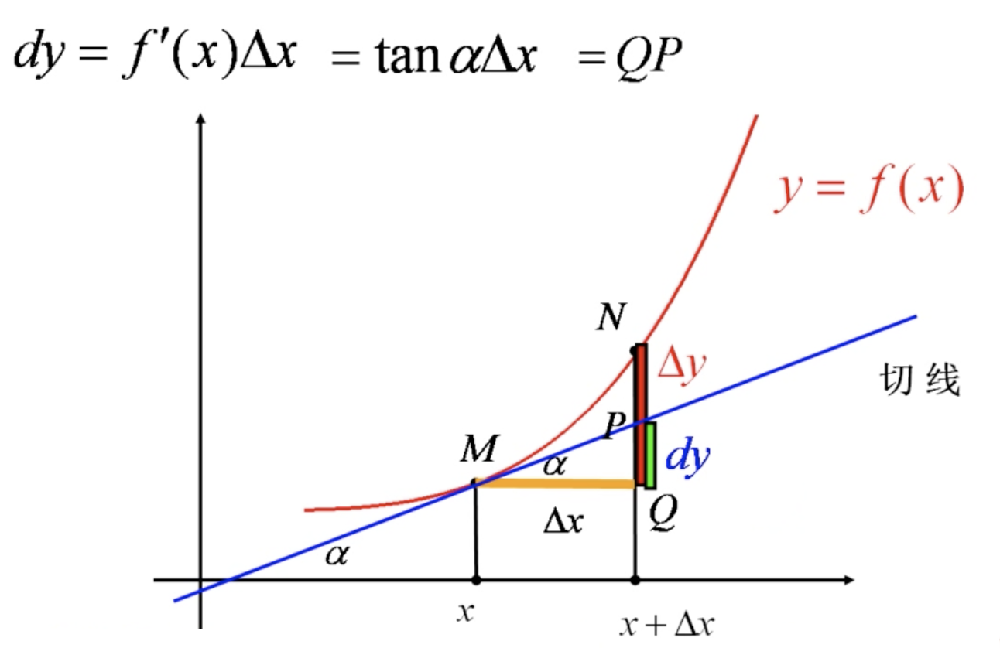

# 微分（differential）

## 一.定义

设在 一点 $x$ 处，$\Delta y=f(x+\Delta x)-f(x)$ ，

如果 $\Delta y = {\color{red} A\color{red} \Delta \color{red}x}+{\color{blue}o\color{blue}(\color{blue}\Delta \color{blue}x\color{blue})}$

其中 $A$ 是只与 $x$ 有关，而与 $\Delta x$ 无关的常数，${\color{blue}o\color{blue}(\color{blue}\Delta \color{blue}x\color{blue})}$ 是 $\Delta x$ 的高阶无穷小，则称函数 $f(x)$ 在点 $x$ 处可微（differentiable) 。

并将线性主部 ${\color{red}A\color{red}\Delta \color{red}x}$ 称为函数在点 $x$ 处对应于 $\Delta x$ 的微分（differential），记做 $dy$：
$$
\begin{align}
dy&={\color{red}A\color{red}\Delta \color{red}x}\\
\\

dy&=f'(x)dx\\
\end{align}
$$

### 1. 可微、可导、连续和有极限的关系

函数在一点可微 $\Leftrightarrow$ 函数在该点可导，且 $dy=f'(x)\Delta x$ ，即 $A=f'(x)$。

导数就是微分之商： 微商

### 2.几何意义

* 函数的局部线性化

  由于 $dy\approx \Delta y$，用局部用切线代替曲线，也称为函数的线性近似。

  线性近似公式：$f(x)\approx f(x_{0})+f'(x_{0})(x-x_{0})$

  特殊情况，$x_{0}=0$ 时：$f(x)\approx f(0)+f'(0)x$，$|x|$  趋于 0。

  > 
  >
  > 例如：
  >
  > $f(x)=sinx\,\, sinx\approx sin0 +cos0\cdot 0$
  >
  > $sinx\approx x$，$x$ 用弧度来表示

* $\Delta y$ 和 $dy$ 的比较

  

## 二.运算法则

每一个导数公式，都对应着一个微分公式：
$$
y'=f'(x)\Rightarrow dy=f'(x)dx
$$

### 1.基本初等函数的微分公式和运算法则

| 导数公式                    | 微分公式                      |
| --------------------------- | ----------------------------- |
| $(x^{\mu})'=\mu x^{\mu -1}$ | $d(x^{\mu})=\mu x^{\mu -1}\,dx$ |
|$(sinx)'= cosx$|$d(sinx)=cosx\,dx$|
|$(cosx)'=-sinx$|$d(cosx)=-sinx\,dx$|
|$(tanx)'=sec^{2}x$|$d(tanx)=sec^{2}x\,dx$|
|$(cotx)'=-csc^{2}x$|$d(cotx)=-csc^{2}x\,dx$|
|$(secx)'=secx\,tanx$|$d(secx)=secx\,tanx\,dx$|
|$(cscx)'=-cscx\,cotx$|$d(cscx)=-cscx\,cotx\,dx$|
|$(a^{x})'=a^{x}\ln a$|$d(a^{x})=a^{x}\ln a\,dx$|
|$(e^{x})'=e^{x}$|$d(e^{x})=e^{x}dx$|
|$(\log_{a}x)'=\frac{1}{x\ln a}$|$d(\log_{a}x)=\frac{1}{x\ln a}\,dx$|
|$(lnx)'=\frac{1}{x}$|$d(\ln x)=\frac{1}{x}\,dx$|
|$(arcsinx)'=\frac{1}{\sqrt{1-x^{2}}}$|$d(arcsinx)=\frac{1}{\sqrt{1-x^{2}}}\,dx$|
|$(arccosx)'=-\frac{1}{\sqrt{1-x^{2}}}$|$d(arccosx)=-\frac{1}{\sqrt{1-x^{2}}}\,dx$|
|$(arctanx)'=\frac{1}{1+x^{2}}$|$d(arctanx)=\frac{1}{1+x^{2}}\,dx$|
|$(arccotx)'=-\frac{1}{1+x^{2}}$|$d(arccotx)=-\frac{1}{1+x^{2}}\,dx$|

|      | 求导法则                                             | 微分法则                                             |
| ---- | ---------------------------------------------------- | ---------------------------------------------------- |
| 和   | $(u\pm v)'=u'\pm v'$                                 | $d(u\pm v)=du+dv$                                    |
| 差   | $(C\,u)'=C\cdot u'$                                  | $d(C\,u)=C\cdot du$                                  |
| 积   | $(uv)'=u'v+uv'$                                      | $d(uv)=vdu+udv$                                      |
| 商   | $(\frac{u}{v})'=\frac{u'v-uv'}{v^{2}}\,\,\,(v\neq0)$ | $d(\frac{u}{v})=\frac{vdu-udv}{v^{2}}\,\,\,(v\neq0)$ |

### 2. 复合函数微分法则

复核函数的微分：微分形式不变性

$$
\begin{align}
& y=f(u)\,\,\,\,u=g(x)\Rightarrow y=f[g(x)]\\
\\
& \frac{dy}{dx}=f'(u)u'\\
\\
&\because u'dx=du\\
\\
&\therefore dy=f'(u)u'=f'(u)du

\end{align}
$$
从我曾向内层逐层微分，直到 $dx$ 出现为止。

### 3.隐函数的微分

用微分法求隐函数的导数是一种好方法。

隐函数求微分时，我们不必考虑谁是自变量，谁是因变量（x，y 地位平等）。

而求导数时，我们必须将 $x$ 视为自变量，$y$ 视为因变量（x，y 地位不平等）。

> 例：
> $$
> \begin{align}
> x&=\ln y \\
> \\
> \textbf{微分}：\\
> dx&=d(\ln y)\\
> &=\frac{1}{y}dy\\
> \therefore dy&=y\cdot dx\\
> \\
> \textbf{求导}：\\
> (x)'&=(\ln y)'\\
> 1&=\frac{1}{y}\cdot y'\\
> \therefore y'&=y
> 
> \end{align}
> $$

### 4.凑微分

已知一个微分，求问是哪一个函数的微分，凑微分是不定积分的基本功。

## * 选学：

### (一).经济学中的常用函数

#### 1.需求函数

某商品的需求量是指在一定的价格水平上，在一定的时间内，消费者愿意而且有能力购买的商品量。

忽略其他次要因素，我们可以认为商品的需求量 $Q_{d}$ 是由商品价格 $P$ 决定的，因此需求量是价格的函数：
$$
Q_{d}=Q_{d}(P)
$$
称为需求函数（也叫需求价格函数）。

一般地，需求商品价格上涨会使需求量减少，因此需求函数一般是价格 $P$  的单调减函数。

* 价格函数

需求函数的反函数也称为需求函数。(需求决定价格，所以也称为价格函数)

* 饱和需求量

  当价格 P = 0 时，此时的需求量称为饱和需求量。

#### 2.供给函数

某商品的供给量是指在一定的价格水平上，在一定的时间内，生产者愿意生产并可提供出售的商品量。

忽略其他次要因素，我们可以认为水上漂的供给量 $Q_{s}$ 是由商品价格 $P$ 决定的，因此供给量是价格的函数：
$$
Q_{s} = Q_{s}(P)
$$
称为供给函数。

一般地，商品的价格上涨，生产者就更愿意生产并向时长提供更多的商品，

因此供给函数一般是几个 $P$ 的单调增函数。

* 均衡价格、均衡数量

  当供给量和需求量相等 $Q_{d}=Q_{s}$ 时，所得的 $P$ 称为商品的均衡价格，此时的供给量和需求量称为均衡数量。

  寻求君合价格是金融经济学的主要问题之一。

#### 3.总成本函数、总收益函数、总利润函数。

总成本是指生产一定数量的产品所需要的总投入。

 总收益是出售一定数量的产品所得到的全部收入。

总利润是总收益减去总成本后的余额。

总成本、总收益和总利润都与产品的产量或销量 $Q$ 有关，因此它们都是 $Q$ 的函数。

总成本函数：$C=C(Q)$

总收益函数：$R=R(Q)$

总利润函数：$L=L(Q)=R(Q)-C(Q)$

