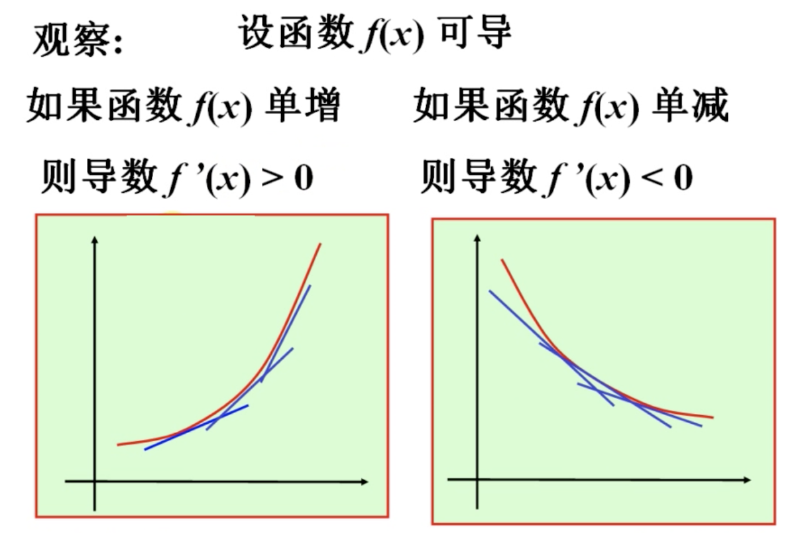
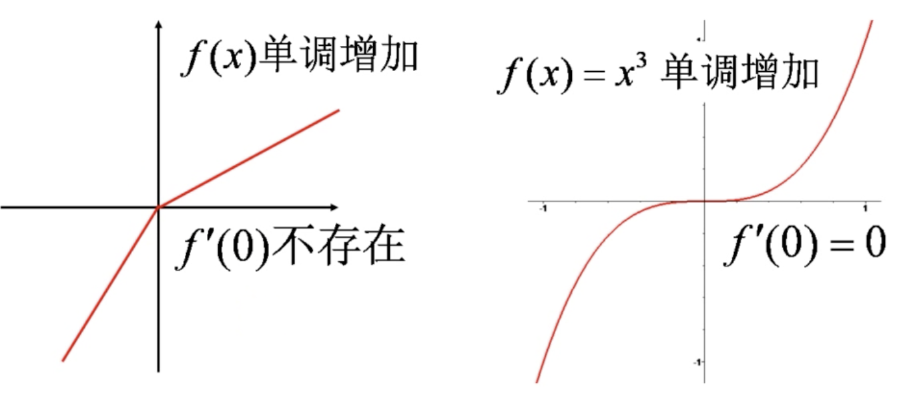
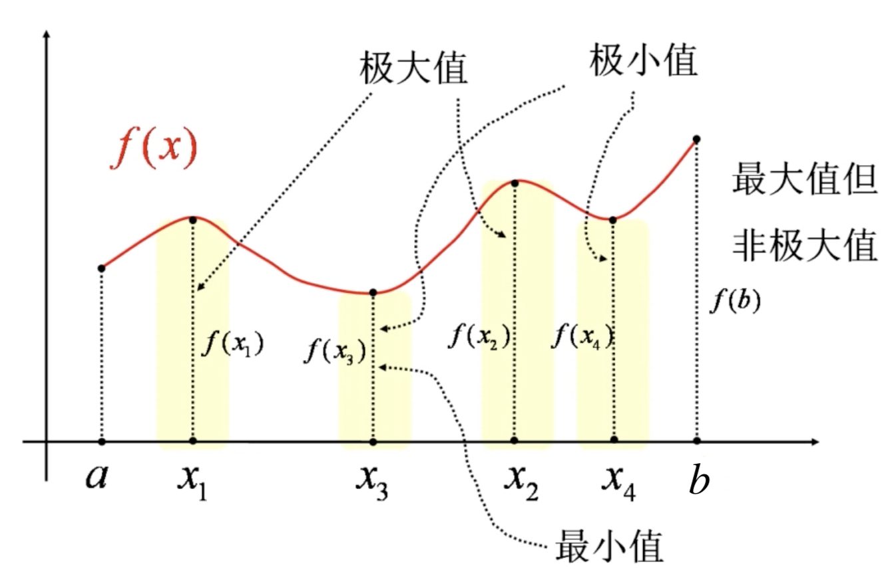
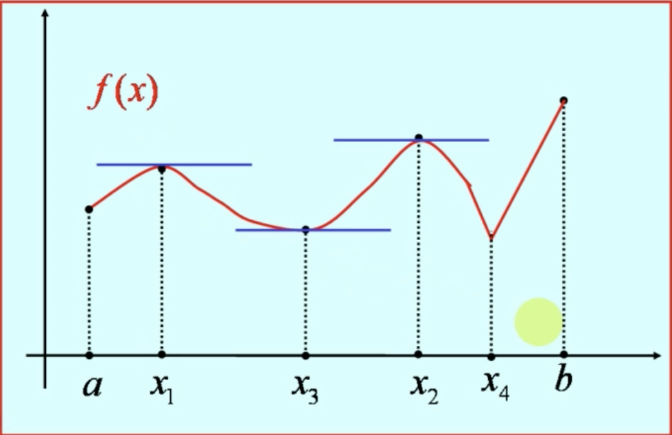
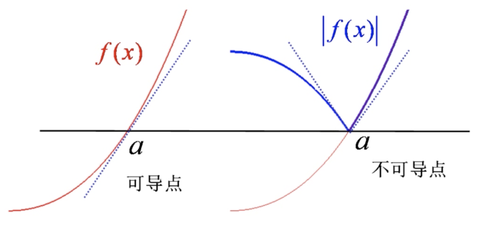

  

# 微分中值定理与导数的应用

## 一.微分中值定理（Mean Value Theorems）

三个微分中值定理之间是等价的。

当 $F(x) = x$ 时，柯西中值定理则可以转化成拉格朗日中值定理，当 $f(a) = f(b)$ 时，拉格朗日中值定理可以转化成罗尔定理。

但证明过程，则是由罗尔定理推到出柯西和拉格朗日。

### 1.费马引理（Fermat Lemma）

设函数 $f(x)$ 在点 $x_{0}$ 的某个邻域内有定义，$f(x)$ 在 $x_{0}$ 处可导且在 $x_{0} $ 处取得极值，则必有 $f'(x_{0})=0$。

### 2.罗尔定理（Rolle）

设函数 $f(x)$ 满足以下三个条件：

(1) $f(x)$在闭区间 $[a,b]$ 上连续；

(2) $f(x)$ 在开区间 $(a,b)$ 内可导；

(3) 端值相等：$f(a)=f(b)$，

则存在 $\xi\in(a,b)$ ，使得 ${\color{red}f\color{red}'\color{red}(\color{red}\xi\color{red})\color{red}=\color{red}0}$。

罗尔定理中，缺少任何一个条件，导数的零点将可能不存在，以下是哪个函数在相应的区间内没有导数为零的点：

* 罗尔定理原型

  1691年，罗尔在研究多项式方程时发现:

  n 次方程 $a_{0}x^{n}+a_{1}x^{n-1}+...+a_{n-1}x+a_{n}=0$ 的每两个相邻的实根之间，一定有下列方程的实根：$a_{0}nx^{n-1}+a_{1}(n-1)x^{n-2}+...+a_{n-1}=0$

> 推论一：
>
> 可导函数的每两个零点之间有一个导数的零点，导函数的每两个零点之间有一个二阶导数的零点。
>
> 驻点：一阶导数的零点。
>
> 拐点：二阶导数的零点。

> 推论二：
>
> 如果 $f'(x) \neq 0$ ，则方程 $f(x)=0$ 不可能有两个根。

### 3.拉格朗日中值定理（Lagrange）

设函数 $f(x)$ 满足以下两个条件：

(1) $f(x)$ 在闭区间 $[a,b]$ 上连续；

(2) $f(x)$ 在开区间 $(a,b)$ 内可导；

则存在 $\xi\in(a,b)$ ，使得：
$$
\begin{align}
\frac{f(b)-f(a)}{b-a}&=f'(\xi)\\
\\
或\,\,\,\,f(b)-f(a)&=f'(\xi)(b-a)
\end{align}
$$

* 有限增量公式：$\Delta y =f'(x+\theta\Delta x)\Delta x$  $(0<\theta<1)$

  有限增量公式是 $\Delta y$ 的准确表达式

>拉格朗日中值定理的推论：
>
>1.常数的导数恒为 0 ，
>
>在一区间上导数恒为零的函数必为常值函数。
>
>2.在一区间上导数恒等的两个函数只相差一个常数。

* 恒等式的证明：$f'(x)\equiv 0\Rightarrow f(x)\equiv C$

### 4.柯西中值定理（Cauchy）

设函数 $f(x)$ 和 $F(x)$ 满足以下条件：

(1) 在闭区间 $[a,b]$ 上连续；

(2) 在开区间 $(a,b)$ 内可导；

(3) $F'(x)\neq 0$ ；

则存在 $\xi\in(a,b)$ ，使得：

$\frac{[f(b)-f(a)]}{[F(b)-F(a)]}=\frac{f'(\xi)}{F’(\xi)}$

> 证明过程: 作辅助函数 $\varphi({\color{red}x})=[F(b)-F(a)]f({\color{red}x})-[f(b)-f(a)]F({\color{red}x})$ ，然后用罗尔定理
>
> ps: 用拉格朗日中值定理是不对的。

## 二. 洛必达法则

洛必达法则是计算未定时极限的一种运算法则。

未定时：$\lim\frac{f(x)}{F(x)}$       $\frac{0}{0}$型   或   $\frac{\infty}{\infty}$型

洛必达法则可以多次使用。

### 1.定理 1

设

(1) $\displaystyle\lim_{x\rightarrow a}f(x) =0$   $\displaystyle\lim_{x\rightarrow a}F(x)=0$；

(2) 两个函数在 $a$ 的某个去心领域可导。且 $F(x)$ 的导数不等于 0；

(3) 极限 $\displaystyle\lim_{x\rightarrow a}\frac{f'(x)}{F'(x)}=A(\infty)$

则 $\displaystyle\lim_{x\rightarrow a}\frac{f(x)}{F(x)}=\lim_{x\rightarrow a}\frac{f'(x)}{F'(x)}=A(\infty)$

### 2.定理 2

$\displaystyle\lim_{x\rightarrow\infty}\frac{f(x)}{F(x)}\overset{\frac{0}{0}型}{====}\lim_{x\rightarrow \infty}\frac{f'(x)}{F'(x)}$

### 3.定理 3

$\lim\frac{f(x)}{F(x)}\overset{\frac{\infty}{\infty}型}{====}\lim\frac{f'(x)}{F'(x)}$

### 4.命题

设函数 $f(x)$ 在 $x_{0}$ 处 $n$ 阶可导，且 $f(x_{0})=f'(x_{0})=...=f^{(n)}(x_{0})=0$，则 $f(x)=0[(x-x_{0})^{n}](x\rightarrow x_{0})$

### 5.其他未定式

#### (1). $ \lim {\color{blue}f\color{blue}(\color{blue}x\color{blue})}\color{red}g\color{red}(\color{red}x\color{red}) $     $\infty\cdot 0$ 型

转化成 $\frac{0}{0}$ 型：$ \lim {\color{blue}f\color{blue}(\color{blue}x\color{blue})}\color{red}g\color{red}(\color{red}x\color{red}) =\lim\frac{\color{red}g\color{red}(\color{red}x\color{red})}{{1}/{{\color{blue}f\color{blue}(\color{blue}x\color{blue})}}}$ 

转化成 $\frac{\infty}{\infty}$ 型：$ \lim {\color{blue}f\color{blue}(\color{blue}x\color{blue})}\color{red}g\color{red}(\color{red}x\color{red}) =\lim\frac{\color{blue}f\color{blue}(\color{blue}x\color{blue})}{{1}/{{\color{red}g\color{red}(\color{red}x\color{red})}}}$ 

转化为基本型，再用洛必达法则

#### (2). $\lim[f(x)-g(x)]$   $\infty-\infty$ 型

通分 $\lim[f(x)-g(x)]=\lim\frac{F(x)}{G(x)}$ ，转化成 $\frac{0}{0}$ 型，再用洛必达法则

#### (3). 幂指函数的极限

$\lim f(x)^{g(x)}$   $1^{\infty}$   $\infty^{0}$    $0^{0}$  型

先转换 $\lim {\color{red}f\color{red}(\color{red}x\color{red})}^{\color{blue}g\color{blue}(\color{blue}x\color{blue})}=e^{\lim\color{blue}g\color{blue}(\color{blue}x\color{blue})\ln\color{red}f\color{red}(\color{red}x\color{red})}$，这时候 $\ln f(x)$ 和 $g(x)$ 一般会是 $0\cdot\infty$ 或 $\infty\cdot0$ 型

*  $1^{\infty}$ 型未定式有特殊的解法

$\lim \color{red}u\color{red}(\color{red}x\color{red})^{\color{blue}v\color{blue}(\color{blue}x\color{blue})}\overset{\color{red}1^{\color{blue}\infty}}{====}e^{\lim \color{blue}v\color{blue}(\color{blue}x\color{blue})(\color{red}u\color{red}(\color{red}x\color{red})-1)}$

## 三.泰勒公式

### 1. 泰勒中值定理 1

设函数 $f(x)$ 在 $x_{0}$ 处有 $0\sim n$ 阶导数，则

$\displaystyle f(x)=\sum^{n}_{k=0}\frac{f^{(k)}(x_{0})}{k!}(x-x_{0})^{k}+0[(x-x_{0})^{n}]$ 。

其中，

 $\displaystyle\sum^{n}_{k=0}\frac{f^{(k)}(x_{0})}{k!}(x-x_{0})^{k}$ 叫做 $f(x)$ 的 ${\color{red}n}$ 次泰勒多项式，

$o[(x-x_{0})^n]$ 叫做佩亚诺余项，记作 $R_{n}(x)$。

###  2.泰勒中值定理 2

设函数 $f(x)$ 在 $x_{0}$ 的某个领域内有 $0\sim n+1$ 阶导数，则对该领域内的任何 $x$， 有

$\displaystyle f(x)=\sum^{n}_{k=0}\frac{f^{(k)}(x_{0})}{k!}(x-x_{0})^{k}+R_{n}(x)$

其中，前部分依然是  $f(x)$ 的 ${\color{red}n}$ 次泰勒多项式，

而 $\displaystyle R_{n}(x)=\frac{f^{(n+1)}(\xi)}{(n+1)!}(x-x_{0})^{n+1}$，称为拉格朗日余项，其中 $x_{0}<\xi<x$。

* 

当 $n=0$ 时，$f(x)=f(x_{0})+f'(\xi)(x-x_{0})$，

转换可得        $f(x)-f(x_{0})=f'(\xi)(x-x_{0})$

这正是拉格朗日中值定理。

所以，泰勒中值定理是拉格朗日中值定理的推广。

* 

当 $x_{0}=0$ 时，得到带拉格朗日余项的麦克劳林公式：

$\displaystyle f(x)=\sum^{n}_{k=0}\frac{f^{(k)}(0)}{k!}x^{k}+\frac{f^{(n+1)}(\color{red}\theta x)}{(n+1)!}x^{n+1}$  (0<$\theta$<1)

或带佩亚诺余项：

$\displaystyle f(x)=\sum^{n}_{k=0}\frac{f^{(k)}(0)}{k!}x^{k}+o(x^{n})$

### 3.常用佩亚诺余项的麦克劳林公式

$$
\begin{align}
\\
sinx &这个函数只有奇次幂，没有偶次幂，2m-1 \leq n，其中佩亚诺余项既可以写成 o(x^{2m})/o(x^{2m-1})。\\
\\
sinx &=x-\frac{x^{3}}{3!}+ \frac{x^{5}}{5!} - ... + (-1)^{m-1}\frac{x^{2m-1}}{(2m-1)!} + o(x^{2m})\\
\\

\\
cosx &这个函数只有偶次幂，没有奇次幂，2m \leq n，其中佩亚诺余项既可以写成 o(x^{2m + 1})/o(x^{2m})。\\
\\
cosx &=1-\frac{x^{2}}{2!}+\frac{x^{4}}{4!}-...+(-1)^{m}\frac{x^{2m}}{(2m)!}+o(x^{2m+1})\\
\\
\\
e^{x} &=1 + x + \frac{x^{2}}{2} + ... +\frac{x^{n}}{n!} + o(x^{n})\\
\\
\\
\ln(1+x) &= x - \frac{x^{2}}{2} + \frac{x^{3}}{3} -...+ (-1)^{n-1}\frac{x^{n}}{n} + o(x^{n})\\
\\
\\
(1+x)^{\alpha} &= 1 + \alpha x + \frac{\alpha(\alpha - 1)}{2!}x^{2} + \frac{\alpha(\alpha - 1)(\alpha - 2)}{3!}x^{3}+...+\frac{\alpha(\alpha-1)...(\alpha-n+1)}{n!}x^{n} + o(x^{n})

\end{align}
$$

无穷小的化解：
$$
\begin{align}
o(x^{m}) \cdot x^{n} &= o(x^{mn})\\

\alpha + o(\alpha) &\sim \alpha\\
\\
\\
o(高阶) \pm o(低阶) &= o(低阶) \\
例如：o(x^{5}) \pm o(x^{4}) &= o(x^{4})
\end{align}
$$

## 四.函数的单调性与曲线的凹凸性

### 1.单调函数

#### 1.1 定义

设 $I$ 是函数 $f(x)$ 的定义域内的一个区间。

函数 $f(x)$ 在区间 $I$ 上单调增加是指：

$\forall x_{1}, x_{2} \in I$        $x_{1} < x_{2} \Rightarrow f(x_{1}) < f(x_{2})$

函数 $f(x)$ 在区间 $I$ 上单调减少是指：

$\forall x_{1}, x_{2} \in I$        $x_{1} < x_{2} \Rightarrow f(x_{1}) > f(x_{2})$

在一个区间上单调增加或单调减少的函数称为单调函数。

#### 1.2 函数单调性的判定法

##### 定理 1 

设函数 $f(x)$ 在闭区间 $[a,b]$ 上连续，在开区间 $(a,b)$ 内可导。

(1) 如果在 $(a,b)$ 内 $f'(x) > 0$ ，则函数 $f(x)$ 在 $[a,b]$ 上单调增加；

(2) 如果在 $(a,b)$ 内 $f'(x) < 0$，则函数 $f(x)$ 在 $[a, b]$ 上单调减少。

>但是，不能说函数单调增加，导数一定大于零。
>
>因为单调函数不一定可导。
>
>即使函数可导，个别点的导数也可以是零。

#### 1.3 函数单调性的应用

(1) 利用函数的单调性证明不等式；

(2) 证明方程有唯一的实根，单调函数在单调区间最多有一个零点（单调函数的曲线穿过 x 轴最多一次）；

## 五.函数的极值与最值

### 1.函数的极值

#### 1.1 定义

函数的极大值就是函数在一个领域内所取到的最大的函数值：局部最大值（local maximum value）。

函数的极小值就是函数在一个领域内所去到的最小的函数值：局部最小值（local minmum value）。

极值点：$x_{i}$ 	 极值：$f(x_{i})$

> 极值是局部概念，极大值不一定大于极小值，极值点必须是定义域的内殿。
>
> 定义域的端点一定不是极值点。

#### 1.2 函数取得极值点处的特点

在可导的极值点处，曲线有水平的切线，从而导数为 0。

##### 定理 1（极值的必要条件）

设函数 $f(x)$ 在点 $x_{0}$ 处可导，且在点 $x_{0}$ 处取得极值，则必有 $f'(x_{0})=0$。（费马引理）

> 函数 $f(x)$ 导数 $f'(x_{0})=0$ 的点，称为驻点 $x_{0}$；
>
> 所以定理 1 也可以这样表述：
>
> 极值的必要条件：可导的极值点必为驻点。	

注意：

(1) 极值点不一定是驻点，因为极值点处不一定有导数。

(2) 驻点也不一定是极值点。

如图

$x_{1}$ 是驻点但不是极值点		$x_{2}$ 是极值点但不是驻点

> 函数可能的极值点？

>
>由极值的必要条件，
>
>可能的极值点：(1) 驻点； (2) 不可导点。 
>
>一般地，这两类点被称为可疑点或临界点。
>
>这种点通常只有有限个。

##### 定理 2 (极值的第一充分条件)

##### 定理 3（极值的第二充分条件）

设函数 $f(x)$ 在点 $x_{0}$ 处二阶可导，且 $f'(x_{0})=0, f''(x_{0}\neq 0)$

则

​	(1) $f''(x_{0})<0 \Rightarrow f(x_{0}) $ 为极大值。

​	(2) $ f''(x_{0}) > 0 \Rightarrow f(x_{0}) $ 为极小值。

##### 定理 4 （极值的高阶充分条件）

设函数 $f(x)$ 在点 $x_{0}$ 处 $n$ 阶可导，且

​		$f^{(k)}(x_{0})=0$  $(k=1,...,n-1)$ ，	$f^{(n)}(x_{0})\neq 0$

则

(1) $n$ 为偶数时， $f(x_{0})$ 为极值。

​			 $f^{(n)}(x_{0}) < 0 \Rightarrow f(x_{0})$ 为极大值

​			 $f^{(n)}(x_{0}) > 0 \Rightarrow f(x_{0})$ 为极小值

(2) $n$ 为奇数时，$f(x_{0})$ 非极值。

#### 1.3 求连续函数的单调区间和极值的步骤

### 2.函数的最值

#### 2.1 定义

函数 $f(x)$ 在集合 $I$ 上的最大（小）的函数值称为 $f(x)$ 在 $I$ 上的最大值（最小值）。

最大值和最小值简称最值。

最值是整体概念，而极值是局部概念。

>最值可以再区间内部取到（也是极值）
>
>也可以再区间端点取到（不是极值）

>可能出现最值的点：(1) 开区间内的点； (2) 两个端点。

#### 2.2 最值定理

在闭区间 $[a,b]$ 上连续函数 $f(x)$ 一定能在该区间上取得最大的函数值和最小的函数值。

#### 2.3 求连续函数在闭区间上的最值方法

(1) 求出函数 $f(x)$ 在开区间 $(a,b)$ 内的驻点和不可导点：$x_{1},...,x_{n}$。

(2) 比较函数值：

​		 $f(x_{1})，... ， f(x_{n})，{\color{red}f}{\color{red}(}{\color{red}a}{\color{red})}, {\color{red}f}{\color{red}(}{\color{red}b}{\color{red})}$

其中的最大者为函数的最大值，最小者为最小值。

>注意：不必判定 $f(x_{1})，... ， f(x_{n})$ 是否为极值。

##### 2.3.1  定理

* 扩展命题：如果 $f(x_{0})=0$ ，且 $f'(x_{0}) \neq 0$ ，则 $|f(x)|$ 在 $x_{0}$ 处不可导。 

##### 2.3.2 定理  $f(x)=|x-x_{0}|g(x)$  的可导性

 $f(x)=|x-x_{0}|g(x)$  在 $x_{0}$ 处可导当且仅当 $\displaystyle\lim_{x\rightarrow x_{0}} g(x) = 0$；

如果 $g(x)$ 在 $x_{0}$ 处连续，则 $f(x) = |x-x_{0}|g(x)$ 在 $x_{0}$ 处可导当且仅当 $g(x_{0})=0$。

#### 2.3 求函数在开区间上的最值

没有边界点，最值一定在 $(a,b)$ 内的极值点处产生。

函数在以区间内不一定有极值，但如果函数在以区间内有唯一的极值，则该极值也是函数在该区间的最值。

## 六.函数的图形描绘

### 1.曲线的凹凸性与拐点

#### 1.1 凹弧的定义

凹弧的更一般的定义：$\forall t\,\,\,(0<t<1)$
$$
\color{Red} f[(1-t)x_{1} + tx_{2}] < (1-t)\color{Blue}f(x_{1}) + t\color{Blue}f(x_{2})
$$

#### 1.2 凸弧的定义

凹弧的更一般的定义：$\forall t\,\,\,(0<t<1)$
$$
\color{Red} f[(1-t)x_{1} + tx_{2}] > (1-t)\color{Blue}f(x_{1}) + t\color{Blue}f(x_{2})
$$

#### 1.3 判断曲线的凹凸性

##### 1.3.1 引理 (利用一阶导数的单调性判断凹凸性)

设函数 $f(x)$ 在 $[a,b]$ 上连续，在 $(a,b)$ 内可导，那么

(1) 若在 $(a,b)$ 内 $f'(x)$ 单调增加，

​		则曲线 $y=f(x)$ 在 $[a,b]$ 上是凹的。

(2) 若在 $(a,b)$ 内 $f'(x)$ 单调减少，

​		则曲线 $y = f(x)$ 在 $[a,b]$ 上是凸的。

##### 1.3.2 定理（曲线凹凸性的判定定理）

>因为
>
>$f''(x) > 0 \Rightarrow f'(x)$ 单增
>
>$f''(x) < 0 \Rightarrow f'(x)$ 单减
>
>由以上引理得到以下定理：

设函数 $f(x)$ 在 $[a,b]$ 上连续，在 $(a,b)$ 内二阶可导，那么

(1) 若在 $(a,b)$ 内 $\color{blue}f\color{blue}'\color{blue}'\color{blue}(\color{blue}x\color{blue}) \color{blue}> \color{blue}0$，

​		则曲线 $y=f(x)$ 在 $[a,b]$ 上是凹的。

(2) 若在 $(a,b)$内 $\color{blue}f\color{blue}'\color{blue}'\color{blue}(\color{blue}x\color{blue}) \color{blue}< \color{blue}0$，

​		则曲线 $y=f(x)$ 在 $[a,b]$ 上是凸的。

## 七.曲率

## 八.方程的近似解